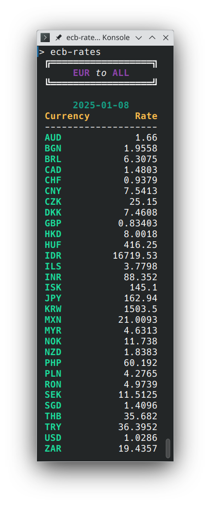
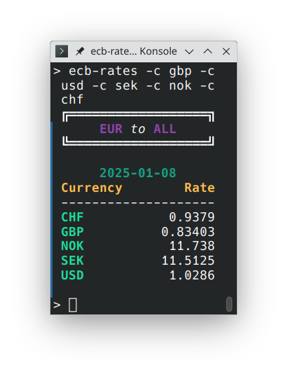
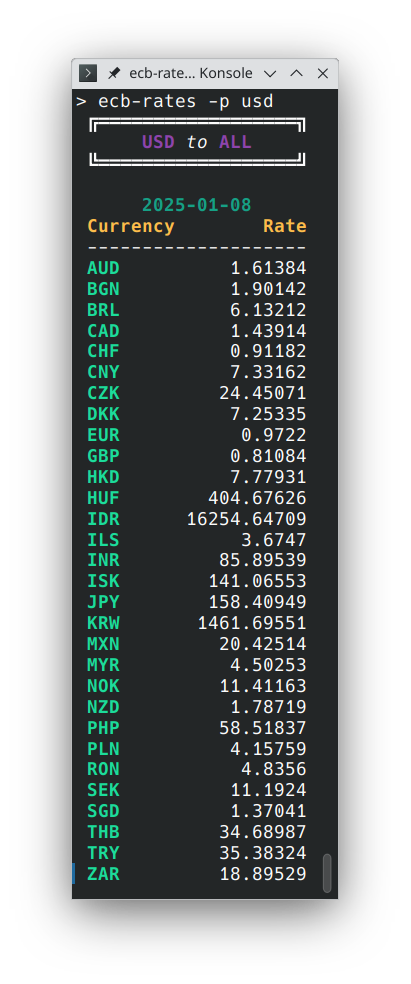
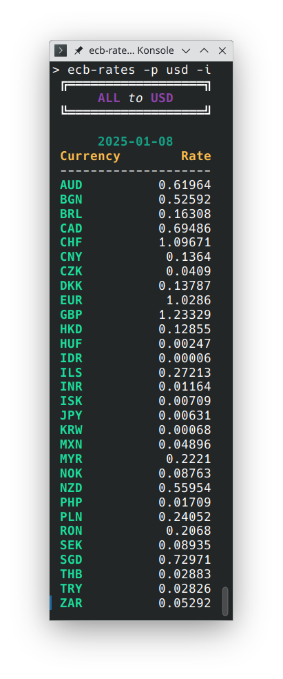
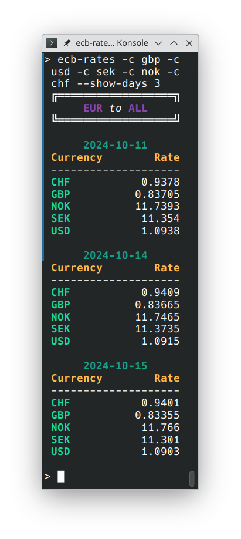

# ECB Rates

A cli utility to fetch the currency rates against the Euro from the ECB.

## Install

First, make sure that you have the rust toolchain installed. If not, then go to [rustup](https://rustup.rs) to install it.

Now, run the following cargo command:

```sh
cargo install --git https://github.com/lov3b/ecb-rates.git
```

Congratulations! Now the cli binary `ecb-rates` will be in your cargo bin folder.

## Features

#### Fetch as many days as you want

It will fetch any of the following api nodes, and reduce them for you.

- Last available day.
- Last 90 days
- Since the dawn of the *EUR*

#### Display select currencies

- as an ASCII table
- in JSON prettified
- in JSON minified

#### Cache

It features an extensive cache, which will [calculate hollidays](src/holiday.rs) in order to know whether to invalidate it or not.

#### Show the rates in your way

Change the rates for the perspective of any currency with the `--perspective` or `-p` flag.

Flip it from `EUR to ALL` to `ALL to EUR` with the `--invert` or `-i` flag. It will work as expected with the *perspective* option.

#### Fast

It wouldn't be a rust project without being *BLAZINGLY FAST*! When the cache is valid a single day will on my computer be shown in 3 ms. When the cache isn't being used it will be ~90ms. The cache speed will largely depend on your drive, the latter will depend on your network speed. Both options are fast enought to be in a `.bashrc` or `.zshrc`

### Examples

#### Show the original data from ECB



#### ...with only select currencies



#### Put the exchange rate in the perspective of any currency



#### Flip it



#### Show multiple days



## Acknowledgment

The data is (obviously) provided by the [European Central Bank](https://www.ecb.europa.eu/stats/policy_and_exchange_rates/euro_reference_exchange_rates/html/index.en.html)
